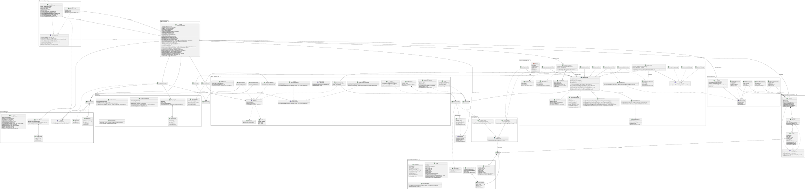
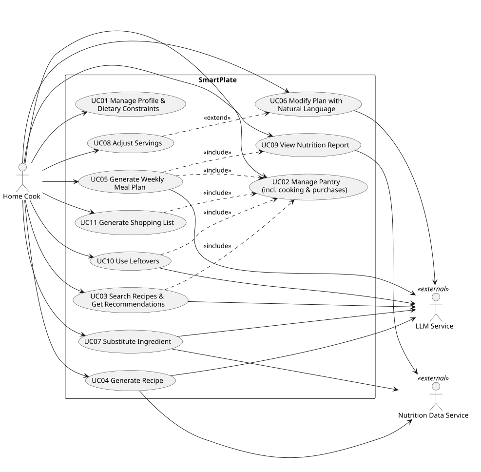
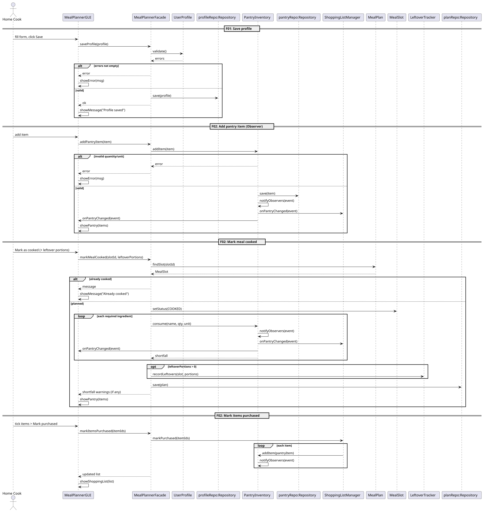
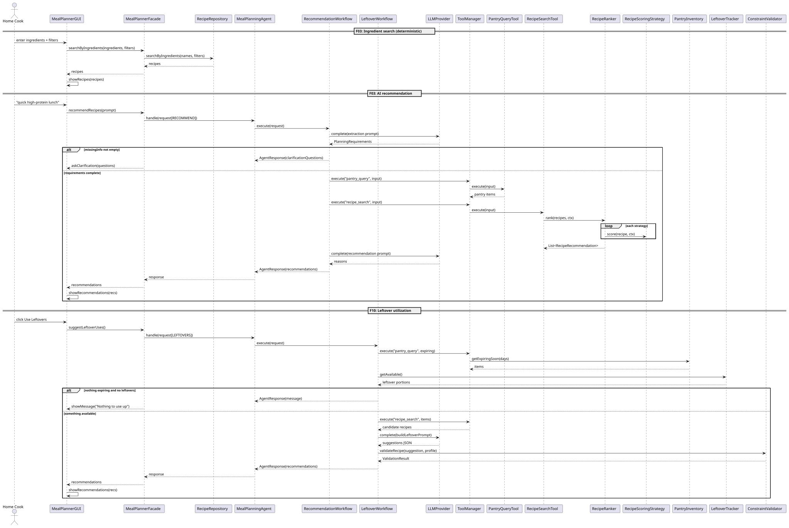
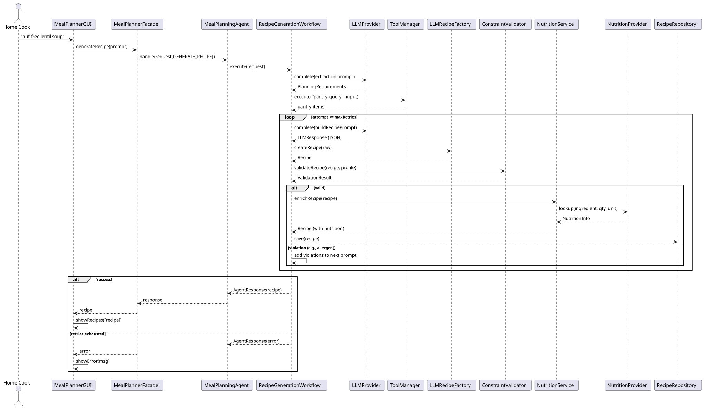
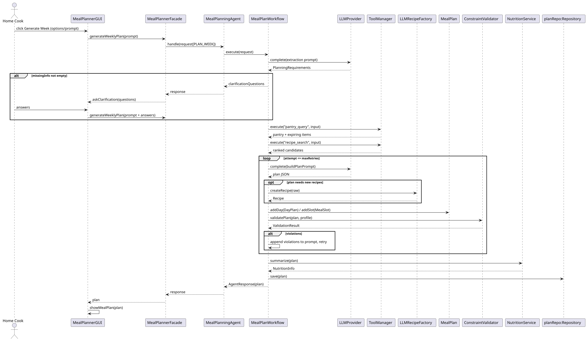
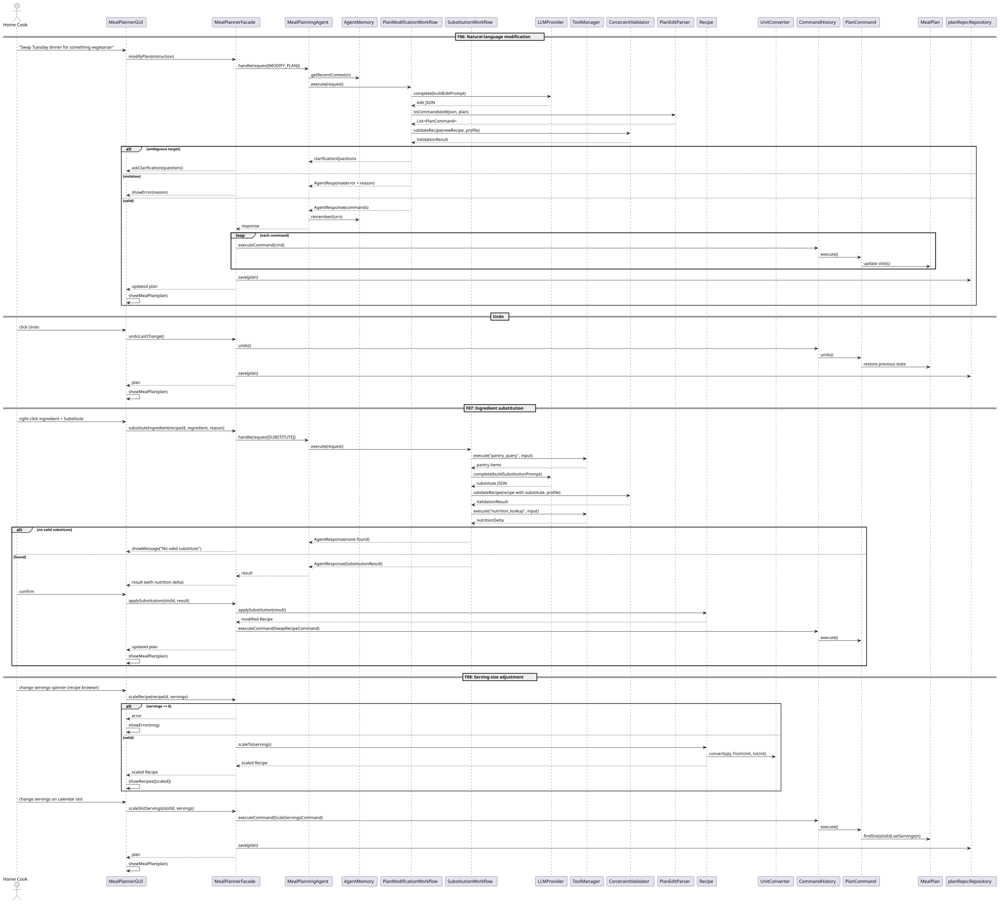
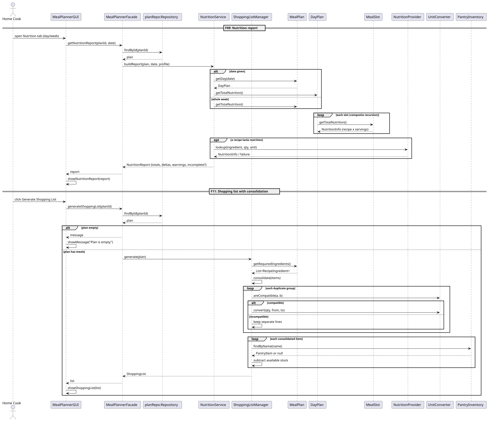

# EECS3311 Fall 2026 — Stage 1 Project Design Report

## SmartPlate: AI Smart Recipe and Meal Planning Agent

# 1. Project Overview

## 1.1 Problem and Motivation

Deciding "what's for dinner?" every day is a surprisingly hard, multi-constraint problem. A household must balance dietary restrictions and allergies, nutrition goals, personal taste, cooking time, the food already in the pantry (some of it close to expiring), and the cost and effort of grocery shopping. Existing recipe apps are static catalogs: they do not reason about the user's pantry, they cannot restructure a whole week when plans change, and they do not connect meal plans to shopping lists. The result is food waste, repeated grocery trips, and meals that ignore dietary needs.

**SmartPlate** is an AI agent that turns natural-language requests ("Plan 5 vegetarian dinners under 30 minutes, use up my spinach and rice") into a validated weekly meal plan, adjusts it conversationally, and keeps the pantry and shopping list synchronized with the plan.

## 1.2 Target Users

- Busy students and young professionals who cook for themselves and want low-waste, low-effort planning.
- Families who need to satisfy several dietary constraints at once (e.g., a nut allergy and a vegetarian member).
- Health-conscious users tracking calories/macros.
- Anyone who wants to cook with what they already have.

## 1.3 What the Agent Can Do

- Maintain a profile of dietary constraints, allergies, dislikes, and nutrition targets.
- Track pantry inventory (quantities, expiry) and react to changes.
- Search recipes by available ingredients and recommend ranked, explained options.
- Generate brand-new recipes tailored to constraints and pantry contents.
- Build a multi-day meal plan through a multi-step workflow (understand → gather context → plan → validate → refine).
- Modify the plan from natural-language instructions, with undo/redo.
- Suggest ingredient substitutions, scale servings, and summarize nutrition.
- Use leftovers and soon-to-expire items, generate a consolidated shopping list, and update the pantry after cooking/shopping.

## 1.4 Why an AI Agent Is Appropriate

A single LLM call cannot do this reliably because the task needs **grounding, tool use, and verification**:

1. **Reasoning over many constraints at once** (allergies, calories, time, pantry) — LLMs handle fuzzy, natural-language constraints well.
2. **Multi-step execution** — the agent extracts requirements, asks for missing info, queries the pantry and recipe database, drafts a plan, validates it, and retries on violations.
3. **Tool use** — pantry data, recipe search, nutrition lookup, and unit conversion come from deterministic tools rather than the model's memory, which prevents hallucinated inventory or nutrition values.
4. **Memory** — conversation history lets users say "swap _that_ for something cheaper".
5. **Safety guardrails** — the LLM proposes; deterministic code (`ConstraintValidator`) decides. An allergen violation is never shown to the user as a valid plan.

## 1.5 AI / LLM Model(s)

- **Primary model:** a hosted LLM (Anthropic Claude, Sonnet-class) accessed over an HTTP API through the `LLMProvider` interface. The model name and API key live in configuration, so the model can be swapped without touching agent code.
- **Test/offline model:** `MockLLMAdapter` returns canned JSON so the system can be unit-tested and demoed without network access.
- The LLM is prompted to return **structured JSON** (validated against a schema) for requirements extraction, plans, recipes, edits, and substitutions.

## 1.6 How the AI Interacts with the Rest of the System

The LLM is never called directly from the GUI/CLI. The flow is:

`GUI/CLI → MealPlannerFacade → MealPlanningAgent → AgentWorkflow → (ToolManager → Tools) + LLMProvider → ConstraintValidator → Domain objects → View`

- **Tools** (`RecipeSearchTool`, `PantryQueryTool`, `NutritionLookupTool`, `UnitConversionTool`) give the agent factual, deterministic data.
- **LLMProvider** performs language understanding and generation.
- **ConstraintValidator** and domain classes enforce correctness.
- **AgentMemory** keeps conversational context across turns.

## 1.7 Overall Architecture

Layered architecture with MVC at the presentation boundary:

| Layer                           | Components                                                                                                                                                |
| ------------------------------- | --------------------------------------------------------------------------------------------------------------------------------------------------------- |
| Presentation (View)             | `MealPlannerGUI` (weekly calendar, recipe browser, pantry, shopping list, AI chat), `MealPlannerCLI` — both implement `MealPlannerView`                   |
| Application (Controller/Facade) | `MealPlannerFacade` — single entry point used by both GUI and CLI                                                                                         |
| Agent & Reasoning Core          | `MealPlanningAgent`, `AgentWorkflow` (+ 6 concrete workflows), `AgentMemory`, `PromptBuilder`, `ConstraintValidator`, `RecipeRanker` + scoring strategies |
| Tool & Adapter Layer            | `ToolManager`, `AgentTool` implementations, `LLMProvider` and `NutritionProvider` adapters                                                                |
| Domain (Model)                  | `UserProfile`, `Recipe`, `PantryInventory`, `MealPlan` composite, `ShoppingList`, `NutritionInfo`, etc.                                                   |
| Services                        | `NutritionService`, `ShoppingListManager`, `LeftoverTracker`, `UnitConverter`                                                                             |
| Persistence                     | `Repository<T>` + `JsonFileRepository<T>`                                                                                                                 |

**GUI screens:** Weekly Meal Calendar, Recipe Browser, Pantry, Shopping List, Profile/Settings, and an AI Chat pane.
**CLI:** the same operations through commands such as `profile set`, `pantry add`, `recipes search`, `plan week "<prompt>"`, `plan edit "<instruction>"`, `plan undo`, `shop generate`, `cook <slot>`, `chat "<message>"`. Both front ends call only `MealPlannerFacade`, so every feature is available in both.

---

# 2. Detailed Feature Specifications

Classification key: **D** = deterministic, **AI** = AI-based, **H** = hybrid (deterministic tools + LLM reasoning, with deterministic validation).

### F01 — Preference Profile & Dietary Constraint Configuration (D)

- **Description:** Stores diet types (vegetarian, vegan, gluten-free, halal…), allergies, disliked ingredients, favorite cuisines, calorie/protein targets, default servings, and max cooking time. Allergies are _hard_ constraints; dislikes are _soft_.
- **User Interaction:** Profile screen with form fields/checkboxes and a Save button (CLI: `profile set …`).
- **Input:** Form values.
- **Output:** Persisted `UserProfile`; confirmation message.
- **AI Involvement:** None (deterministic). The saved profile is consumed by all AI workflows.
- **Workflow:** GUI collects data → `saveProfile()` → `UserProfile.validate()` → `Repository.save()` → confirmation.
- **Error/Alternative:** Invalid values (negative calories, empty name) → field-level error; conflicting constraints (e.g., vegan + "must include chicken") → warning and rejection; storage failure → error and profile unchanged.

### F02 — Pantry Inventory Management & Automatic Updates (D)

- **Description:** Add, edit, and remove pantry items with quantity, unit, location, and expiry date; highlights items expiring soon. The pantry also updates itself: marking a meal as cooked deducts its ingredients (and records leftover portions), and marking shopping-list items as purchased adds them.
- **User Interaction:** Pantry panel table with Add/Edit/Delete; "Mark as cooked" on a calendar slot; "Mark purchased" on shopping items (CLI: `pantry add|edit|rm|list`, `cook <slot>`, `shop bought <items>`).
- **Input:** Ingredient name, quantity, unit, expiry date; or a slot id (+ leftover portions); or purchased item ids.
- **Output:** Updated inventory; observers (shopping list, GUI) are notified; slot status updated.
- **AI Involvement:** None.
- **Workflow:** _Manual edit:_ GUI → `addPantryItem()/updatePantryItem()/removePantryItem()` → `PantryInventory` mutates, saves, and calls `notifyObservers()`. _Cooked:_ `markMealCooked()` → slot set to COOKED → `PantryInventory.consume()` per scaled ingredient → leftovers recorded → observers notified. _Purchased:_ `markItemsPurchased()` → `ShoppingListManager.markPurchased()` → `PantryInventory.addItem()`.
- **Error/Alternative:** Negative quantity or unknown unit → rejected; duplicate ingredient → merged into the existing item (with unit conversion) after confirmation; past expiry date → accepted but flagged "expired"; insufficient stock when cooking → deduct what exists and report the shortfall; slot already cooked → ignored with a message.

### F03 — Recipe Search & AI Recommendation (H)

- **Description:** Finds recipes that can be made with given ingredients (with diet, time, and cuisine filters and a "% of ingredients on hand" indicator), and recommends ranked recipes for natural-language requests such as "quick high-protein lunch", with an explanation for each.
- **User Interaction:** Search bar, filters, and a "Use my pantry" toggle in the Recipe Browser; a Recommend button or the chat pane.
- **Input:** Ingredient list and filters, or a free-text request, plus profile and pantry.
- **Output:** Matching recipes with pantry-match percentage, or a ranked `RecipeRecommendation` list with reasons.
- **AI Involvement:** Hybrid — searching and scoring are deterministic (`RecipeRanker` with scoring strategies); the LLM interprets the request and writes the explanations.
- **Workflow:** _Search:_ `searchByIngredients()` → `RecipeRepository` → filter by profile constraints → show. _Recommend:_ extract requirements (LLM) → `PantryQueryTool` + `RecipeSearchTool` (calls `RecipeRanker`) → LLM writes reasons → response.
- **Error/Alternative:** Empty search input → prompt for at least one ingredient; no results or no recipe passes hard constraints → suggest relaxing filters or generating a recipe (F04); ambiguous request → clarification questions; LLM failure → ranked list with generic reasons.

### F04 — AI Recipe Generation (H)

- **Description:** Creates a new recipe from a prompt ("a nut-free soup using lentils and carrots").
- **User Interaction:** "Generate Recipe" dialog or chat message.
- **Input:** Free-text prompt + profile + pantry.
- **Output:** A complete `Recipe` (ingredients, steps, times, nutrition) saved to the recipe library.
- **AI Involvement:** Hybrid — LLM drafts; `LLMRecipeFactory` normalizes; `ConstraintValidator` verifies; nutrition is computed by `NutritionService`.
- **Workflow:** Extract requirements → get pantry context → LLM drafts JSON → `LLMRecipeFactory.createRecipe()` → validate → enrich nutrition → save.
- **Error/Alternative:** Malformed JSON → retry (max 2); allergen detected → regenerate with violation feedback; still failing → show error and offer to relax constraints.

### F05 — Weekly Meal Planning (H)

- **Description:** Produces a multi-day plan (e.g., 7 days × breakfast/lunch/dinner) that respects constraints and targets and prefers pantry/expiring ingredients and variety.
- **User Interaction:** "Generate Week" button with options (days, meals/day, servings) or chat; result appears in the Weekly Meal Calendar.
- **Input:** Prompt/options + profile + pantry + recipe library.
- **Output:** A `MealPlan` composite (days → meal slots).
- **AI Involvement:** Hybrid multi-step agent workflow with validation and retry.
- **Workflow:** Extract requirements → ask for missing info if needed → gather pantry/recipes → LLM plans → build composite → validate → retry if violations → compute nutrition → save → display.
- **Error/Alternative:** Missing info → clarification dialog; too few valid recipes → LLM-generated recipes via F04 logic; validation fails after retries → partial plan with flagged slots; LLM unavailable → error with option to build manually from the recipe browser.

### F06 — Natural-Language Meal-Plan Modification (H)

- **Description:** Edits the plan from instructions such as "Swap Tuesday's dinner for something vegetarian" or "Remove all fish meals". Supports undo/redo.
- **User Interaction:** Chat pane, plus Undo/Redo buttons.
- **Input:** Instruction text + current plan.
- **Output:** Updated plan; list of applied changes.
- **AI Involvement:** Hybrid — the LLM translates the instruction into structured edits; the system executes them as undoable commands.
- **Workflow:** Interpret instruction → LLM returns edits → `PlanEditParser` builds `PlanCommand`s → validate → `CommandHistory.executeCommand()` → save → refresh calendar.
- **Error/Alternative:** Ambiguous target ("that meal") → clarification using `AgentMemory`; edit violates constraints → rejected with explanation; no change possible → message; undo with empty history → no-op notice.

### F07 — Ingredient Substitution (H)

- **Description:** Suggests a replacement for an ingredient (allergy, missing item, preference) and shows the nutrition impact.
- **User Interaction:** Right-click an ingredient in a recipe → "Substitute…" (or chat).
- **Input:** Recipe/slot, ingredient, reason.
- **Output:** `SubstitutionResult` (substitute, adjusted quantity, nutrition delta); can be applied to the plan.
- **AI Involvement:** Hybrid — LLM proposes options; validator checks constraints; nutrition delta is computed deterministically.
- **Workflow:** Gather pantry context → LLM proposes → validate against profile → compute nutrition delta → user confirms → apply as an undoable command.
- **Error/Alternative:** No valid substitute → say so and suggest alternative recipes; substitute not in pantry → add to shopping list option.

### F08 — Serving-Size Adjustment (D)

- **Description:** Scales a recipe or a meal slot to a new number of servings; ingredient amounts and nutrition totals update.
- **User Interaction:** Servings spinner on a recipe or calendar slot.
- **Input:** Recipe/slot, new servings.
- **Output:** Scaled recipe; updated plan, nutrition, and shopping needs.
- **AI Involvement:** None.
- **Workflow:** `scaleRecipe()` previews; `scaleSlotServings()` creates a `ScaleServingsCommand`; amounts scaled via `UnitConverter`.
- **Error/Alternative:** Servings ≤ 0 or > limit → rejected; non-scalable items (e.g., "1 egg" at fractional scale) → rounded with a note.

### F09 — Nutrition Information Organization (D)

- **Description:** Aggregates calories, protein, carbs, fat, fiber, and sodium per recipe, per day, and per week, and compares against profile targets.
- **User Interaction:** "Nutrition" tab / day-header badges in the calendar.
- **Input:** Plan, date (or week), profile targets.
- **Output:** `NutritionReport` (totals, targets, deltas, warnings).
- **AI Involvement:** None (data from `NutritionProvider` adapters).
- **Workflow:** Load plan → `NutritionService.buildReport()` → recursive composite aggregation → compare to targets → display.
- **Error/Alternative:** Missing nutrition data for an ingredient → lookup via provider, else mark the report "incomplete" and list missing items.

### F10 — Leftover Utilization (H)

- **Description:** Suggests meals that use leftover portions and soon-to-expire pantry items to reduce waste.
- **User Interaction:** "Use Leftovers" button or chat.
- **Input:** Pantry (expiring items), recorded leftover portions, profile.
- **Output:** Recommendations that can be inserted into the plan.
- **AI Involvement:** Hybrid — expiring/leftover data is deterministic; the LLM creatively combines them.
- **Workflow:** Query expiring items + `LeftoverTracker` → search recipes → LLM proposes combos → validate → display.
- **Error/Alternative:** Nothing expiring → inform user; no valid combination → suggest freezing/storage tips from the LLM.

### F11 — Shopping List Generation with Duplicate Consolidation (D)

- **Description:** Builds a shopping list from the plan's required ingredients, subtracts pantry stock, merges duplicates (e.g., "200 g onion" + "1 onion") using unit conversion, and groups by category.
- **User Interaction:** "Generate Shopping List" button; checkboxes to tick items off.
- **Input:** Plan, pantry.
- **Output:** `ShoppingList` of consolidated items.
- **AI Involvement:** None.
- **Workflow:** Collect `getRequiredIngredients()` from the composite → consolidate by name/unit → subtract pantry → group → display.
- **Error/Alternative:** Incompatible units (cups vs. whole) → kept as separate lines with a note; empty plan → message; everything in stock → "Nothing to buy".

---

# 3. UML Class Diagram

- [ UML Class Diagram](docs/diagrams/class/class-diagram.puml)
  

---

# 4. Design Pattern Explanations

Seven patterns are used. Each solves a concrete problem in this application.

### 4.1 Facade

- **Problem:** The GUI and CLI would otherwise need to know about the agent, repositories, pantry, services, and command history, and each front end would duplicate the orchestration logic.
- **Participants:** `MealPlannerFacade` (Facade); subsystem classes `MealPlanningAgent`, `PantryInventory`, `ShoppingListManager`, `NutritionService`, `LeftoverTracker`, `CommandHistory`, repositories; clients `MealPlannerGUI`, `MealPlannerCLI`.
- **Why appropriate:** One simple, feature-oriented API (`generateWeeklyPlan()`, `generateShoppingList()`, …) shared by both interfaces; it also acts as the MVC controller.
- **Without it:** GUI and CLI would be tightly coupled to ~10 subsystem classes, features would be implemented twice, and changing the AI backend would ripple through the UI code.

### 4.2 Strategy

- **Problem:** Recipe recommendation must combine several scoring criteria (pantry overlap, preference match, nutrition fit), and the weights/criteria should be changeable without modifying the ranker.
- **Participants:** `RecipeScoringStrategy` (Strategy), `PantryOverlapStrategy`, `PreferenceMatchStrategy`, `NutritionFitStrategy` (Concrete Strategies), `RecipeRanker` (Context).
- **Why appropriate:** New criteria (e.g., cost, seasonality) are added as new classes; weights can differ between "recommend" and "use leftovers" without changing `RecipeRanker`.
- **Without it:** A large `if/else` scoring function that must be edited every time a criterion changes and is hard to unit-test.

### 4.3 Adapter

- **Problem:** The system must work with external services whose interfaces differ (LLM vendor API, nutrition API) and must be testable offline.
- **Participants:** Targets `LLMProvider`, `NutritionProvider`; adapters `AnthropicLLMAdapter`, `MockLLMAdapter`, `NutritionApiAdapter`, `LocalNutritionTableAdapter`; clients `AgentWorkflow`, `NutritionService`.
- **Why appropriate:** Agent code depends only on the target interfaces; vendor HTTP details are isolated in adapters; mocks let us test workflows deterministically.
- **Without it:** Vendor-specific code would leak throughout the agent, switching providers would be a large rewrite, and tests would require live API calls.

### 4.4 Factory Method

- **Problem:** Recipes originate from different raw formats (LLM JSON with inconsistent units/fields, imported catalog files) but must always become valid, normalized `Recipe` objects.
- **Participants:** `RecipeFactory` (Creator), `LLMRecipeFactory` and `CatalogRecipeFactory` (Concrete Creators), `Recipe` (Product); clients `RecipeGenerationWorkflow`, `MealPlanWorkflow`, `RecipeRepository`.
- **Why appropriate:** Each source-specific parsing/normalization rule (e.g., tagging `AI_GENERATED`, standardizing units, defaulting missing fields) is encapsulated; callers only call `createRecipe()`.
- **Without it:** Parsing logic would be scattered across workflows and the repository, creating inconsistent recipe objects and duplicated cleanup code.

### 4.5 Composite

- **Problem:** A meal plan is a tree (week → days → meals), yet the application needs the same operations (total nutrition, required ingredients, meal count) at every level — per meal, per day, per week.
- **Participants:** `PlanComponent` (Component), `MealSlot` (Leaf), `DayPlan` and `MealPlan` (Composites).
- **Why appropriate:** `getTotalNutrition()` and `getRequiredIngredients()` are computed recursively with one uniform call, powering F08/F09/F11 without special-case code.
- **Without it:** Separate nested loops for each query (daily nutrition, weekly nutrition, shopping needs), with duplicated traversal logic that breaks if the plan structure changes.

### 4.6 Command

- **Problem:** Plan edits come from both the user and the LLM (via natural language), must be undoable/redoable, and should be logged. AI-proposed edits are especially important to reverse.
- **Participants:** `PlanCommand` (Command), `SwapRecipeCommand`, `AddMealCommand`, `RemoveMealCommand`, `ScaleServingsCommand` (Concrete Commands), `MealPlan` (Receiver), `CommandHistory` (Invoker), `PlanEditParser` (creates commands from LLM output).
- **Why appropriate:** The LLM returns a _description_ of edits that are converted into command objects; they can be validated, executed, and undone uniformly.
- **Without it:** Edits would mutate the plan directly, undo would require storing whole-plan snapshots or custom reversal logic per edit type, and LLM mistakes would be hard to roll back.

### 4.7 Observer

- **Problem:** Pantry changes (manual edits, cooking, purchases) must automatically refresh the shopping list and the pantry panel without the pantry knowing about those classes.
- **Participants:** `PantryInventory` (Subject), `PantryObserver` (Observer), `ShoppingListManager` and `MealPlannerGUI` (Concrete Observers), `PantryEvent`.
- **Why appropriate:** Decouples the model from the views; new observers (e.g., an expiry notifier) can be added without modifying `PantryInventory`.
- **Without it:** `PantryInventory` would need direct references to the shopping list and the GUI, and every code path that changes stock would have to remember to refresh them, leading to stale views.

**MVC (architectural):** `MealPlannerGUI`/`MealPlannerCLI` = View, `MealPlannerFacade` = Controller, domain classes = Model.

---

# 5. Use-Case Diagram

**Actors**

- **Home Cook** (primary user)
- **LLM Service** (external AI actor)
- **Nutrition Data Service** (external API; optional, with a local fallback)

- [UML use case diagram](docs/diagrams/use-case/use-case-diagram.puml)
  

---

# 6. Detailed Use-Case Descriptions

### UC01 — Manage Profile & Dietary Constraints

- **Actor(s):** Home Cook
- **Goal:** Record diet, allergies, dislikes, and nutrition targets so all suggestions respect them.
- **Preconditions:** Application is running.
- **Trigger:** User opens the Profile screen (or `profile set` in the CLI) and presses Save.
- **Main Success Scenario:** 1) User enters or edits profile fields. 2) GUI sends data to the facade. 3) System validates. 4) System saves the profile. 5) System confirms.
- **Alternative/Exception Flows:** 3a) Invalid values → field errors, return to step 1. 3b) Conflicting constraints → warning, user corrects. 4a) Storage failure → error shown, profile unchanged.
- **Postconditions:** A valid `UserProfile` is persisted and used by subsequent AI tasks.
- **Related Feature(s):** F01

### UC02 — Manage Pantry (including cooking and purchases)

- **Actor(s):** Home Cook
- **Goal:** Keep the digital pantry in sync with real food stock.
- **Preconditions:** None (for cooking/purchase updates: a plan slot or shopping list exists).
- **Trigger:** User adds, edits, or removes a pantry item; marks a meal cooked; or marks shopping items purchased.
- **Main Success Scenario:** 1) User enters item details (or marks a meal cooked / items purchased, optionally entering leftover portions). 2) System validates. 3) System updates the inventory (adds/edits/removes, deducts cooked ingredients, or adds purchased items) and saves. 4) System notifies observers. 5) Pantry panel and shopping list refresh.
- **Alternative/Exception Flows:** 2a) Invalid quantity/unit → rejected. 3a) Duplicate ingredient → merge prompt. 3b) Expired date → saved with "expired" flag. 3c) Insufficient stock when cooking → deduct available stock and show shortfall. 3d) Meal already cooked → ignored with message.
- **Postconditions:** Inventory, slot status, leftover records, and dependent views are consistent.
- **Related Feature(s):** F02 (also underpins F03, F05, F10, F11)

### UC03 — Search Recipes & Get Recommendations

- **Actor(s):** Home Cook; LLM Service
- **Goal:** Find recipes that fit available ingredients and receive ranked, explained suggestions.
- **Preconditions:** Recipe library is loaded; profile exists (defaults allowed).
- **Trigger:** User submits an ingredient search, presses Recommend, or asks in chat.
- **Main Success Scenario:** 1) User enters ingredients/filters or a free-text request. 2) For a request, the agent extracts requirements via the LLM. 3) System reads the pantry (UC02 include). 4) System queries the recipe repository, removes recipes violating profile constraints, and ranks the rest. 5) LLM writes explanations (for recommendations). 6) System displays results with pantry-match percentage.
- **Alternative/Exception Flows:** 1a) Empty search input → prompt. 2a) Ambiguous request → clarification questions. 4a) No results or no recipe passes hard constraints → suggest relaxing filters or UC04. 5a) LLM unavailable → ranked list with generic reasons.
- **Postconditions:** Results shown; no data changed.
- **Related Feature(s):** F03

### UC04 — Generate Recipe

- **Actor(s):** Home Cook; LLM Service; Nutrition Data Service
- **Goal:** Obtain a new, constraint-safe recipe.
- **Preconditions:** LLM reachable (or mock configured).
- **Trigger:** User submits a recipe prompt.
- **Main Success Scenario:** 1) User enters prompt. 2) Agent extracts requirements. 3) Agent gathers pantry context. 4) LLM drafts a recipe. 5) Factory builds a `Recipe`. 6) Validator checks constraints. 7) System computes nutrition. 8) Recipe is saved and displayed.
- **Alternative/Exception Flows:** 4a) Malformed output → retry (max 2). 6a) Violation (e.g., allergen) → regenerate with feedback; if still failing → error. 7a) Nutrition lookup fails → recipe saved flagged "incomplete nutrition".
- **Postconditions:** New recipe stored in the library.
- **Related Feature(s):** F04

### UC05 — Generate Weekly Meal Plan

- **Actor(s):** Home Cook; LLM Service
- **Goal:** Get a complete validated meal plan for several days.
- **Preconditions:** Profile exists; recipe library or LLM available.
- **Trigger:** User presses Generate Week or sends a planning prompt.
- **Main Success Scenario:** 1) User supplies prompt/options. 2) Agent extracts requirements. 3) Agent reads pantry and finds candidate recipes. 4) LLM proposes a plan. 5) System builds the plan composite. 6) Validator checks the plan. 7) System computes nutrition (UC09 include). 8) Plan is saved and shown in the calendar.
- **Alternative/Exception Flows:** 2a) Missing info → clarification dialog. 6a) Violations → retry with feedback (max 2); then partial plan with flagged slots. 4a) LLM unavailable → error and offer manual planning.
- **Postconditions:** A `MealPlan` is saved and set as the current plan.
- **Related Feature(s):** F05, F09

### UC06 — Modify Plan with Natural Language

- **Actor(s):** Home Cook; LLM Service
- **Goal:** Change the plan conversationally, with undo.
- **Preconditions:** A current plan exists.
- **Trigger:** User types an instruction in chat or presses Undo/Redo.
- **Main Success Scenario:** 1) User enters instruction. 2) Agent (using memory) interprets it. 3) LLM returns structured edits. 4) System converts them to commands and validates. 5) Commands execute. 6) Plan is saved and the calendar refreshes.
- **Alternative/Exception Flows:** 2a) Ambiguous target → clarification. 4a) Edit violates constraints → rejected with explanation. Undo/Redo: system reverses/reapplies the last command; empty history → notice.
- **Postconditions:** Plan updated; change recorded in history.
- **Related Feature(s):** F06 (extended by F08)

### UC07 — Substitute Ingredient

- **Actor(s):** Home Cook; LLM Service; Nutrition Data Service
- **Goal:** Replace an ingredient while keeping the recipe valid.
- **Preconditions:** A recipe or plan slot is selected.
- **Trigger:** User selects "Substitute…" on an ingredient.
- **Main Success Scenario:** 1) User picks ingredient and reason. 2) Agent gathers pantry context. 3) LLM proposes a substitute. 4) Validator checks constraints. 5) System computes nutrition delta. 6) User confirms. 7) Substitution applied as an undoable command.
- **Alternative/Exception Flows:** 4a) No valid substitute → inform user, suggest another recipe. 6a) User declines → nothing changes. 7a) Substitute not in pantry → offer to add to shopping list.
- **Postconditions:** Slot's recipe updated (if confirmed).
- **Related Feature(s):** F07

### UC08 — Adjust Servings

- **Actor(s):** Home Cook
- **Goal:** Scale a recipe or meal to a different number of servings.
- **Preconditions:** Recipe or slot selected.
- **Trigger:** User changes the servings control.
- **Main Success Scenario:** 1) User enters new servings. 2) System scales ingredients and nutrition. 3) For a plan slot, a scale command is executed. 4) Plan and nutrition refresh.
- **Alternative/Exception Flows:** 1a) Invalid number → rejected. 2a) Non-divisible amounts → rounded with note.
- **Postconditions:** Slot servings updated (if applied).
- **Related Feature(s):** F08

### UC09 — View Nutrition Report

- **Actor(s):** Home Cook; Nutrition Data Service
- **Goal:** Understand nutrition for a day or week versus targets.
- **Preconditions:** A plan exists.
- **Trigger:** User opens the Nutrition tab.
- **Main Success Scenario:** 1) User selects day/week. 2) System aggregates nutrition recursively. 3) System compares with profile targets. 4) Report displayed.
- **Alternative/Exception Flows:** 2a) Missing data → provider lookup; if unavailable, report flagged incomplete.
- **Postconditions:** None (read-only).
- **Related Feature(s):** F09

### UC10 — Use Leftovers

- **Actor(s):** Home Cook; LLM Service
- **Goal:** Reduce waste by planning around leftovers and expiring items.
- **Preconditions:** Pantry or leftover records exist.
- **Trigger:** User presses Use Leftovers.
- **Main Success Scenario:** 1) System collects expiring items and leftover portions. 2) System finds candidate recipes. 3) LLM proposes combinations. 4) Validator checks them. 5) Suggestions shown; user may add one to the plan.
- **Alternative/Exception Flows:** 1a) Nothing expiring → message. 4a) No valid combination → storage/freezing tips.
- **Postconditions:** Suggestions displayed; plan changes only if user accepts.
- **Related Feature(s):** F10

### UC11 — Generate Shopping List

- **Actor(s):** Home Cook
- **Goal:** Get a consolidated list of what to buy.
- **Preconditions:** A plan exists.
- **Trigger:** User presses Generate Shopping List.
- **Main Success Scenario:** 1) System gathers required ingredients from the plan. 2) Merges duplicates with unit conversion. 3) Subtracts pantry stock. 4) Groups by category. 5) Displays list.
- **Alternative/Exception Flows:** 2a) Incompatible units → separate lines with note. 1a) Empty plan → message. 3a) Everything in stock → "Nothing to buy".
- **Postconditions:** `ShoppingList` created and kept in sync via pantry notifications.
- **Related Feature(s):** F11

---

# 7. Sequence Diagrams

Six diagrams cover all 11 features. Features that share the same interaction structure are combined into one diagram, with each feature (or scenario) shown as its own labelled section (`== ... ==`). All diagrams use classes and methods from the class diagram.

| Diagram                                           | Features      | Use Cases        |
| ------------------------------------------------- | ------------- | ---------------- |
| SD01 Profile & Pantry (incl. cooking & purchases) | F01, F02      | UC01, UC02       |
| SD02 Search, Recommendation & Leftovers           | F03, F10      | UC03, UC10       |
| SD03 Generate Recipe                              | F04           | UC04             |
| SD04 Generate Weekly Meal Plan                    | F05           | UC05             |
| SD05 Modify Plan, Substitute & Scale              | F06, F07, F08 | UC06, UC07, UC08 |
| SD06 Nutrition Report & Shopping List             | F09, F11      | UC09, UC11       |

## SD01 — Profile & Pantry, including Cooking and Purchases (F01, F02)

- [Sequence Diagram 1 ](docs/diagrams/sequence/sd01.puml)
  

## SD02 — Search, Recommendation & Leftovers (F03, F10)

- [Sequence Diagram 2 ](docs/diagrams/sequence/sd02.puml)
  

## SD03 — Generate Recipe (F04)

- [Sequence Diagram 3 ](docs/diagrams/sequence/sd03.puml)
  

## SD04 — Generate Weekly Meal Plan (F05)

- [Sequence Diagram 4 ](docs/diagrams/sequence/sd04.puml)
  

## SD05 — Modify Plan, Substitute & Scale (F06, F07, F08)

- [Sequence Diagram 5 ](docs/diagrams/sequence/sd05.puml)
  

## SD06 — Nutrition Report & Shopping List (F09, F11)

- [Sequence Diagram 6 ](docs/diagrams/sequence/sd06.puml)
  

---

# 8. Feature-to-Design Traceability Table

| Feature | Description                                                | Type | Use Case | Classes                                                                                                                                                                                                      | Key Methods                                                                                                                                             | Sequence Diagram | Design Pattern(s)                          |
| ------- | ---------------------------------------------------------- | ---- | -------- | ------------------------------------------------------------------------------------------------------------------------------------------------------------------------------------------------------------ | ------------------------------------------------------------------------------------------------------------------------------------------------------- | ---------------- | ------------------------------------------ |
| F01     | Preference profile & dietary constraints                   | D    | UC01     | MealPlannerGUI/CLI, MealPlannerFacade, UserProfile, Repository, JsonFileRepository                                                                                                                           | onProfileSaved(), saveProfile(), validate(), save()                                                                                                     | SD01             | Facade                                     |
| F02     | Pantry management & automatic updates (cooking, purchases) | D    | UC02     | MealPlannerGUI/CLI, MealPlannerFacade, PantryInventory, PantryItem, PantryEvent, PantryObserver, ShoppingListManager, MealPlan, MealSlot, LeftoverTracker                                                    | addPantryItem(), addItem(), consume(), notifyObservers(), onPantryChanged(), markMealCooked(), markItemsPurchased(), markPurchased(), recordLeftovers() | SD01             | Observer, Facade                           |
| F03     | Recipe search & AI recommendation                          | H    | UC03     | RecipeRepository, SearchFilters, MealPlanningAgent, RecommendationWorkflow, ToolManager, PantryQueryTool, RecipeSearchTool, RecipeRanker, RecipeScoringStrategy (3 impls), LLMProvider, RecipeRecommendation | searchByIngredients(), recommendRecipes(), handle(), execute(), rank(), score(), complete()                                                             | SD02             | Strategy, Adapter, Facade                  |
| F04     | AI recipe generation                                       | H    | UC04     | RecipeGenerationWorkflow, PromptBuilder, LLMProvider, LLMRecipeFactory, ConstraintValidator, NutritionService, NutritionProvider, RecipeRepository                                                           | generateRecipe(), buildRecipePrompt(), createRecipe(), validateRecipe(), enrichRecipe(), lookup()                                                       | SD03             | Factory Method, Adapter, Facade            |
| F05     | Weekly meal planning                                       | H    | UC05     | MealPlanWorkflow, MealPlan, DayPlan, MealSlot, ConstraintValidator, NutritionService, ToolManager, LLMRecipeFactory, Repository                                                                              | generateWeeklyPlan(), execute(), buildPlanPrompt(), addDay(), addSlot(), validatePlan(), summarize()                                                    | SD04             | Composite, Factory Method, Adapter, Facade |
| F06     | NL plan modification (+undo/redo)                          | H    | UC06     | PlanModificationWorkflow, AgentMemory, PlanEditParser, PlanCommand (4 impls), CommandHistory, MealPlan                                                                                                       | modifyPlan(), buildEditPrompt(), toCommands(), executeCommand(), undo(), redo(), remember()                                                             | SD05             | Command, Adapter, Facade                   |
| F07     | Ingredient substitution                                    | H    | UC07     | SubstitutionWorkflow, SubstitutionResult, Recipe, ConstraintValidator, NutritionLookupTool, SwapRecipeCommand, CommandHistory                                                                                | substituteIngredient(), applySubstitution(), buildSubstitutionPrompt(), Recipe.applySubstitution()                                                      | SD05             | Command, Adapter, Facade                   |
| F08     | Serving-size adjustment                                    | D    | UC08     | Recipe, UnitConverter, ScaleServingsCommand, CommandHistory, MealSlot, MealPlan                                                                                                                              | scaleRecipe(), scaleSlotServings(), Recipe.scaleTo(), convert(), setServings()                                                                          | SD05             | Command, Composite                         |
| F09     | Nutrition information organization                         | D    | UC09     | NutritionService, NutritionReport, NutritionProvider (+2 adapters), PlanComponent, MealPlan, DayPlan, MealSlot, NutritionInfo                                                                                | getNutritionReport(), buildReport(), getTotalNutrition(), add(), lookup()                                                                               | SD06             | Composite, Adapter                         |
| F10     | Leftover utilization                                       | H    | UC10     | LeftoverWorkflow, LeftoverTracker, LeftoverPortion, PantryInventory, PantryQueryTool, RecipeSearchTool, LLMProvider, ConstraintValidator                                                                     | suggestLeftoverUses(), getExpiringSoon(), getAvailable(), buildLeftoverPrompt()                                                                         | SD02             | Strategy, Adapter, Facade                  |
| F11     | Shopping list & duplicate consolidation                    | D    | UC11     | ShoppingListManager, ShoppingList, ShoppingItem, UnitConverter, PantryInventory, MealPlan                                                                                                                    | generateShoppingList(), generate(), consolidate(), getRequiredIngredients(), findByName(), convert()                                                    | SD06             | Composite, Observer, Facade                |

**Pattern coverage check:** Facade (all features), Strategy (F03, F10), Adapter (F03–F07, F09, F10), Factory Method (F04, F05), Composite (F05, F08, F09, F11), Command (F06–F08), Observer (F02, F11).

---

# 9. Feature Implementation Explanations

### F01 — Preference Profile & Dietary Constraints

**Use Case:** UC01 | **Sequence Diagram:** SD01
**Classes:** `MealPlannerGUI`/`MealPlannerCLI` collect input; `MealPlannerFacade` coordinates; `UserProfile` holds and validates data; `Repository<UserProfile>` persists.
**Methods:** `onProfileSaved()`, `saveProfile()`, `UserProfile.validate()`, `Repository.save()`.
**Execution:** On Save, the view calls `saveProfile()`. The facade calls `validate()`, which returns a list of problems (negative targets, empty name, contradictory constraints). If empty, the facade saves via the repository and the view shows a confirmation; otherwise `showError()` is called. Allergies are stored as hard constraints that `ConstraintValidator` later enforces.

### F02 — Pantry Inventory Management & Automatic Updates

**Use Case:** UC02 | **Sequence Diagram:** SD01
**Classes:** `PantryInventory` (Subject), `PantryItem`, `PantryEvent`, `PantryObserver`, `ShoppingListManager` and `MealPlannerGUI` (Observers), `MealPlannerFacade`, `MealPlan`, `MealSlot`, `LeftoverTracker`.
**Methods:** `addPantryItem()`, `updatePantryItem()`, `removePantryItem()`, `addItem()`, `consume()`, `notifyObservers()`, `onPantryChanged()`, `markMealCooked()`, `markItemsPurchased()`, `markPurchased()`, `recordLeftovers()`.
**Execution:** For manual edits, the facade forwards the change to `PantryInventory`, which validates, mutates its item list, persists it, and creates a `PantryEvent`; `notifyObservers()` calls `onPantryChanged()` on every observer so the pantry panel and shopping list refresh. When a meal is marked cooked, the facade sets the slot status, calls `consume()` for each scaled ingredient (returning any shortfall for a warning), and records leftover portions. When items are marked purchased, `ShoppingListManager.markPurchased()` moves them into the pantry via `addItem()`.

### F03 — Recipe Search & AI Recommendation

**Use Case:** UC03 | **Sequence Diagram:** SD02
**Classes:** `RecipeRepository`, `SearchFilters`, `MealPlannerFacade`, `MealPlanningAgent`, `RecommendationWorkflow`, `ToolManager`, `PantryQueryTool`, `RecipeSearchTool`, `RecipeRanker`, three `RecipeScoringStrategy` classes, `LLMProvider`, `RecipeRecommendation`.
**Methods:** `searchByIngredients()`, `recommendRecipes()`, `handle()`, `execute()`, `PantryQueryTool.execute()`, `RecipeSearchTool.execute()`, `RecipeRanker.rank()`, `score()`, `LLMProvider.complete()`.
**Execution:** _Search:_ the view passes ingredient names and filters to the facade, which asks `RecipeRepository` to match recipes by ingredient overlap, applying filters and profile restrictions; results are shown with match %. _Recommend:_ the facade wraps the prompt in an `AgentRequest` with intent `RECOMMEND`. The workflow asks the LLM to extract requirements, then pulls pantry data and a ranked candidate list through the tools. `RecipeRanker` combines the weighted strategy scores deterministically, the LLM writes a short reason per recommendation, and `RecipeRecommendation` objects are returned to the view.

### F04 — AI Recipe Generation

**Use Case:** UC04 | **Sequence Diagram:** SD03
**Classes:** `RecipeGenerationWorkflow`, `PromptBuilder`, `LLMProvider`, `LLMRecipeFactory`, `ConstraintValidator`, `NutritionService`, `NutritionProvider`, `RecipeRepository`.
**Methods:** `generateRecipe()`, `buildRecipePrompt()`, `complete()`, `createRecipe()`, `validateRecipe()`, `enrichRecipe()`, `lookup()`, `save()`.
**Execution:** The workflow gathers pantry context and builds a JSON-schema prompt. The LLM's output is converted by `LLMRecipeFactory` into a normalized `Recipe`. `ConstraintValidator` rejects recipes containing allergens or violating diet rules, triggering a retry with the violations appended. A valid recipe gets nutrition computed deterministically by `NutritionService`, is saved, and returned.

### F05 — Weekly Meal Planning

**Use Case:** UC05 | **Sequence Diagram:** SD04
**Classes:** `MealPlanWorkflow`, `ToolManager`, tools, `LLMProvider`, `LLMRecipeFactory`, `MealPlan`/`DayPlan`/`MealSlot`, `ConstraintValidator`, `NutritionService`, `Repository<MealPlan>`.
**Methods:** `generateWeeklyPlan()`, `execute()`, `extractRequirements()`, `gatherContext()`, `buildPlanPrompt()`, `addDay()`, `addSlot()`, `validatePlan()`, `summarize()`, `save()`.
**Execution:** The workflow extracts requirements (asking clarifying questions when `missingInfo` is non-empty), retrieves pantry and candidate recipes via tools, and asks the LLM for a structured plan. The response is assembled into the `MealPlan` composite, and `validatePlan()` checks allergens, calorie ranges, and variety. Violations are fed back for a bounded number of retries. The final plan is saved and displayed.

### F06 — Natural-Language Plan Modification

**Use Case:** UC06 | **Sequence Diagram:** SD05
**Classes:** `PlanModificationWorkflow`, `AgentMemory`, `PlanEditParser`, `PlanCommand` implementations, `CommandHistory`, `MealPlan`.
**Methods:** `modifyPlan()`, `getRecentContext()`, `buildEditPrompt()`, `toCommands()`, `executeCommand()`, `undo()`, `redo()`.
**Execution:** The agent adds recent conversation context so references like "that dinner" resolve. The LLM returns structured edits, `PlanEditParser` turns them into command objects, and the validator checks any new recipes. The facade runs each command through `CommandHistory`, which stores it on the undo stack; `undoLastChange()` calls `undo()` on the last command.

### F07 — Ingredient Substitution

**Use Case:** UC07 | **Sequence Diagram:** SD05
**Classes:** `SubstitutionWorkflow`, `SubstitutionResult`, `Recipe`, `ConstraintValidator`, `NutritionLookupTool`, `SwapRecipeCommand`, `CommandHistory`.
**Methods:** `substituteIngredient()`, `buildSubstitutionPrompt()`, `validateRecipe()`, `NutritionLookupTool.execute()`, `applySubstitution()`, `Recipe.applySubstitution()`.
**Execution:** The LLM proposes a substitute considering the reason and pantry contents. The validator ensures it does not break constraints, and a tool computes the nutrition difference. The user sees the proposal and confirms; `applySubstitution()` creates a modified copy of the recipe and applies it as an undoable `SwapRecipeCommand`.

### F08 — Serving-Size Adjustment

**Use Case:** UC08 | **Sequence Diagram:** SD05
**Classes:** `Recipe`, `UnitConverter`, `ScaleServingsCommand`, `CommandHistory`, `MealSlot`, `MealPlan`.
**Methods:** `scaleRecipe()`, `Recipe.scaleTo()`, `UnitConverter.convert()`, `scaleSlotServings()`, `executeCommand()`, `MealSlot.setServings()`.
**Execution:** For previews, `Recipe.scaleTo()` multiplies ingredient quantities (normalizing units) and nutrition. For plan slots, a `ScaleServingsCommand` records old and new servings so the change can be undone; composite aggregation then automatically updates nutrition and shopping needs.

### F09 — Nutrition Information Organization

**Use Case:** UC09 | **Sequence Diagram:** SD06
**Classes:** `NutritionService`, `NutritionReport`, `NutritionInfo`, `PlanComponent` composite classes, `NutritionProvider` and adapters.
**Methods:** `getNutritionReport()`, `buildReport()`, `getTotalNutrition()`, `NutritionInfo.add()`, `lookup()`.
**Execution:** `buildReport()` asks the chosen composite node (a day or the whole plan) for `getTotalNutrition()`, which recursively sums child nutrition scaled by servings. Totals are compared with profile targets to produce deltas and warnings. Missing ingredient data triggers a provider lookup; if that fails, the report is marked incomplete.

### F10 — Leftover Utilization

**Use Case:** UC10 | **Sequence Diagram:** SD02
**Classes:** `LeftoverWorkflow`, `LeftoverTracker`, `PantryInventory`, `PantryQueryTool`, `RecipeSearchTool`, `LLMProvider`, `ConstraintValidator`.
**Methods:** `suggestLeftoverUses()`, `getExpiringSoon()`, `getAvailable()`, `buildLeftoverPrompt()`, `validateRecipe()`.
**Execution:** The workflow deterministically collects expiring items and leftover portions, finds candidate recipes, then lets the LLM propose creative combinations (e.g., fried rice from leftover rice and wilting vegetables). Suggestions are validated and returned as recommendations the user can add to the plan through F06.

### F11 — Shopping List Generation with Duplicate Consolidation

**Use Case:** UC11 | **Sequence Diagram:** SD06
**Classes:** `ShoppingListManager`, `ShoppingList`, `ShoppingItem`, `UnitConverter`, `PantryInventory`, `MealPlan`.
**Methods:** `generateShoppingList()`, `generate()`, `getRequiredIngredients()`, `consolidate()`, `areCompatible()`, `convert()`, `findByName()`.
**Execution:** `generate()` retrieves every required ingredient through one composite call, groups items by normalized name, converts compatible units, sums quantities, subtracts matching pantry stock, and groups by category. As an observer of `PantryInventory`, `ShoppingListManager` also updates the list when stock changes.

---

# Appendix A — Requirement Checklist

| Requirement                                | Where satisfied                                                                          |
| ------------------------------------------ | ---------------------------------------------------------------------------------------- |
| GUI                                        | `MealPlannerGUI` (calendar, recipe browser, pantry, shopping list, chat) — §1.7, §3      |
| CLI                                        | `MealPlannerCLI` via the same `MealPlannerFacade` — §1.7, §3                             |
| ≥ 10 meaningful features                   | F01–F11 — §2                                                                             |
| ≥ 5 design patterns                        | 7 patterns — §4                                                                          |
| AI/LLM model                               | `LLMProvider` → `AnthropicLLMAdapter` (+ `MockLLMAdapter`) — §1.5                        |
| Agent behavior                             | Multi-step workflows, tool use, memory, validation/retry, decision making — §1.4, §3, §7 |
| Class, use-case, sequence diagrams         | §3, §5, §7                                                                               |
| Traceability + implementation explanations | §8, §9                                                                                   |
